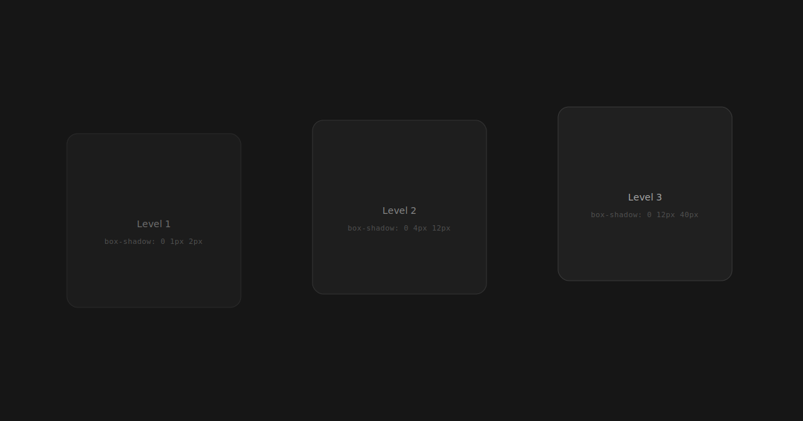

When we interact with digital interfaces, what makes some feel more intuitive than others? Often, it comes down to **depth** — the visual layering that guides our attention and creates a sense of spatial hierarchy.

## The Illusion of Space

Flat design taught us the value of simplicity. But somewhere along the way, we lost something important: the sense that elements exist in relation to each other in space.

Good depth design isn't about adding drop shadows everywhere. It's about creating a **meaningful hierarchy** that helps users understand what's important and what's actionable.

## Principles of Depth

There are a few key principles that guide effective depth in interfaces:

- **Elevation** communicates interactivity. Elements that can be acted upon should feel "raised" from the surface.
- **Layering** creates context. Modal dialogs sit above the content they relate to, reinforcing their temporary nature.
- **Shadows** should be physically plausible. The direction, blur, and opacity of shadows should feel consistent with a single light source.
- **Translucency** connects layers. When background content is visible through overlays, it maintains spatial context.

## Light and Shadow

Consider how shadows work in the physical world. They're not uniform — they have a direction, a softness, and they change based on the distance between the object and the surface it's casting onto.




```css
/* A natural shadow progression */
.level-1 {
  box-shadow: 0 1px 2px rgba(0, 0, 0, 0.05);
}

.level-2 {
  box-shadow: 0 4px 12px rgba(0, 0, 0, 0.08);
}

.level-3 {
  box-shadow: 0 12px 40px rgba(0, 0, 0, 0.12);
}
```

Each level of elevation should correspond to a semantic meaning in your interface. Don't just add shadows for decoration — use them to communicate purpose.

## Material and Surface

The best interfaces treat their elements as physical materials. A card that slides in from the right should have a sense of weight. A button that depresses should feel tactile.

This doesn't mean we need to go back to skeuomorphism. Modern depth design takes the **lessons** from physical materials — weight, friction, elasticity — and applies them subtly to digital interactions.


> The best interface is one that feels inevitable. Not because it follows trends, but because it follows the physics of attention.

## Practical Application

When implementing depth in your designs:

1. Start with a clear elevation system (2-4 levels is usually sufficient)
2. Use consistent shadow directions throughout the interface
3. Reserve the highest elevation for the most critical interactive elements
4. Test with both light and dark modes — depth perception changes dramatically with color scheme
5. Consider motion — elements changing elevation should animate smoothly

---

Depth is not decoration. It's a functional design tool that, when used thoughtfully, makes interfaces feel more natural and intuitive. The goal is never to impress with visual complexity, but to guide with visual clarity.

